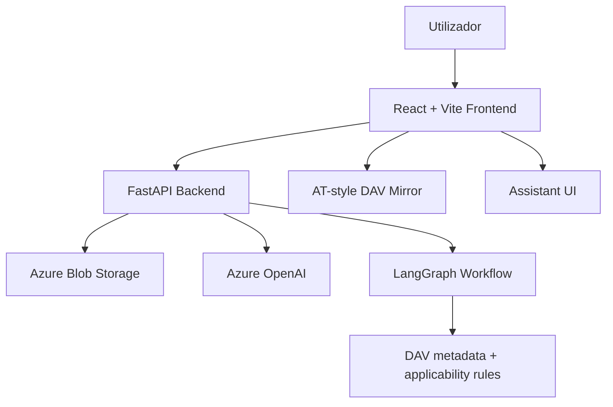

# Car Legalizer Assistant

Uma plataforma agentic para ajudar na legalização de veículos em Portugal, com foco no preenchimento da **Declaração Aduaneira de Veículos (DAV)** da Autoridade Tributária.

O produto recebe documentos do processo, classifica-os, extrai dados relevantes, cruza informação entre fontes, induz campos equivalentes, deteta campos em falta e guia o utilizador até uma DAV mais completa e auditável.

> Estado do projeto: produto em construção, já com frontend React, backend FastAPI, pipeline de extração, espelho DAV ao estilo AT, assistant de revisão e preparação para deploy em Azure.

## Preview

Substitui estes placeholders pelos teus prints quando quiseres fazer showcase do produto.

| Process Hub | Agent Flow |
| --- | --- |
|  |  |

| DAV Mirror | Assistant |
| --- | --- |
|  |  |

| Document Preview | Mobile |
| --- | --- |
|  |  |

## O que faz

- **Process Hub** para criar processos novos ou retomar processos guardados em Azure Blob Storage.
- **Upload inteligente** de PDFs/imagens, com divisão de PDFs em páginas JPG no browser.
- **Classificação documental** para identificar faturas, certificados, transporte, homologação, inspeções e outros documentos relevantes.
- **Extração multimodal** com Azure OpenAI para obter dados estruturados por página.
- **Harmonização DAV** para consolidar várias fontes num único `dados_carro`.
- **Autofill determinístico** para preencher campos equivalentes, como comprador/declarante, datas espelhadas, valores e campos AT relacionados.
- **Metadados de confiança por campo**: extraído, induzido, utilizador, em falta, revisão, conflito ou não aplicável.
- **Regras de aplicabilidade** para bloquear campos que não fazem sentido, por exemplo dados de intermediário quando não houve intermediário.
- **Assistant de revisão** que pergunta primeiro decisões com impacto e depois ajuda a preencher campos em falta.
- **Espelho DAV ao estilo AT** com tabs, secções e códigos próximos do formulário real.
- **Preview e download de documentos** diretamente no frontend.
- **Timeline agentic** para acompanhar upload, classificação, extração, harmonização, autofill e revisão.
- **Preparação para login Microsoft** via MSAL e backend bearer-token validation.
- **Preparação para deploy Azure** com Docker, Container Apps, Static Web Apps e GitHub Actions.

## Fluxo do produto

```mermaid
flowchart LR
    A["Criar ou abrir processo"] --> B["Upload de documentos"]
    B --> C["Classificação"]
    C --> D["Extração por página"]
    D --> E["Harmonização DAV"]
    E --> F["Autofill e regras"]
    F --> G["Assistant de revisão"]
    G --> H["Espelho DAV"]
    H --> I["DAV pronta para validação"]
```



## Arquitetura



## Stack

- **Frontend:** React, TypeScript, Vite, CSS, lucide-react, pdfjs-dist.
- **Backend:** FastAPI, Pydantic, LangGraph, Azure OpenAI SDK, Azure Blob Storage SDK.
- **AI:** Azure OpenAI vision/text extraction, deterministic harmonization/autofill layers.
- **Deploy:** Docker, Azure Container Apps, Azure Static Web Apps, GitHub Actions.

## Estrutura

```text
app/
  graph/            Backend workflow, extraction, autofill, DAV metadata
  models/           Pydantic state/event models
  prompts/          Classification/extraction/DAV prompts
  storage/          Azure Blob client
frontend/
  src/              React app, DAV mirror, assistant, API client
deploy/             Azure deployment guides
.github/workflows/  CI/CD for backend and frontend
```

## Como correr localmente

### 1. Backend

Cria um `.env` local com as tuas variáveis. Não faças commit desse ficheiro.

```powershell
AZURE_STORAGE_CONNECTION_STRING=...
CONTAINER_NAME=car-legalization
AZURE_OPENAI_API_KEY=...
AZURE_OPENAI_ENDPOINT=https://<resource>.openai.azure.com/
AZURE_OPENAI_DEPLOYMENT=gpt-4o
AZURE_OPENAI_API_VERSION=2024-11-20
AUTH_REQUIRED=false
CORS_ORIGINS=http://localhost:5173
```

Instala e corre:

```powershell
venv\Scripts\activate
pip install -r requirements.txt
uvicorn app.main:app --reload --port 8000
```

### 2. Frontend

```powershell
cd frontend
npm install
copy .env.example .env
npm run dev
```

Por default, o frontend espera a API em:

```text
http://localhost:8000
```

## Login Microsoft

O projeto já tem preparação para Microsoft login via MSAL.

Para desenvolvimento/demo local, deixa:

```text
AUTH_REQUIRED=false
VITE_AUTH_CLIENT_ID=
```

Quando quiseres ativar login:

- cria uma App Registration no Microsoft Entra ID;
- configura redirect URI do frontend;
- expõe um API scope;
- preenche `VITE_AUTH_*` no frontend;
- preenche `AZURE_AUTH_*` no backend;
- muda `AUTH_REQUIRED=true`.

## Deploy em Azure

O caminho recomendado para este produto:

- backend em **Azure Container Apps**;
- frontend em **Azure Static Web Apps**;
- Blob Storage e Azure OpenAI como serviços geridos;
- GitHub Actions para CI/CD.

Guias:

- [Azure Container Apps deploy](deploy/azure-container-apps.md)
- [GitHub Actions secrets](deploy/github-actions-secrets.md)

Antes de publicar: roda as chaves que estiverem em `.env` local e guarda tudo como secrets no Azure/GitHub.

## Testes

Backend:

```powershell
venv\Scripts\python.exe -m unittest discover -s app\tests -p "test*.py"
venv\Scripts\python.exe -m compileall -q app
```

Frontend:

```powershell
cd frontend
npm run build
```

Docker:

```powershell
docker build -t car-legalizer-backend:local .
```

## Roadmap

- Login Microsoft ativo em produção.
- Geração/exportação final da DAV.
- Melhor auditoria por fonte/documento/página.
- Mais regras AT de aplicabilidade.
- Melhor chunking do frontend build.
- Observabilidade Azure com dashboards de erros/progresso.

## Segurança

- Nunca commitar `.env`, chaves Azure, connection strings ou documentos reais de clientes.
- Rodar chaves expostas antes de qualquer deploy público.
- Em produção, usar `AUTH_REQUIRED=true`.
- Restringir `CORS_ORIGINS` ao domínio real do frontend.
- Manter processos isolados por utilizador quando o login estiver ativo.

## Licença

Ver [LICENSE](LICENSE).
